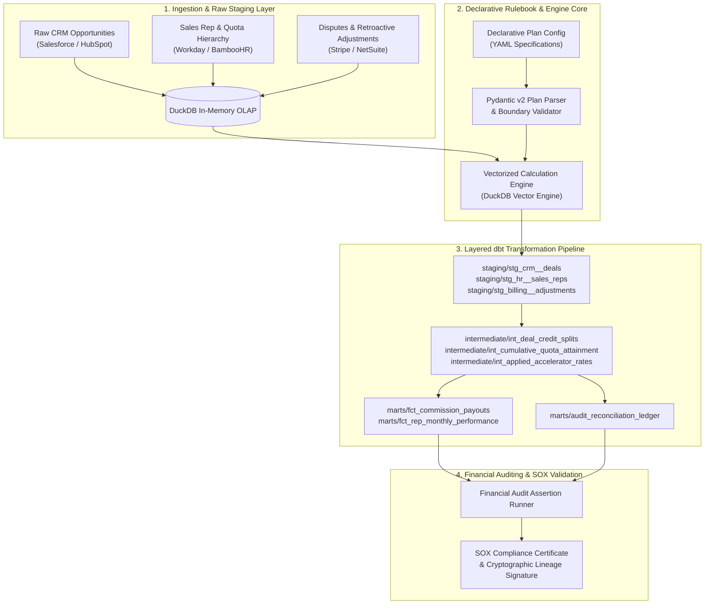

<div align="center">

# ⚡ IncentiFlow

### High-Throughput Multi-Tenant Sales Incentive Compensation & SOX Auditing Engine
**A Code-First Analytics Engineering Framework for Declarative Commission Modeling, Vectorized OLAP Transformations, and Cryptographic Financial Reconciliation.**

[](https://www.python.org/)
[](https://docs.getdbt.com/)
[](https://duckdb.org/)
[](https://docs.pydantic.dev/)
[]()
[](LICENSE)

[Architecture](#-system-architecture) •
[Mathematical Formulation](#-mathematical-formulation) •
[Data Lineage & dbt Models](#-dimensional-data-lineage--dbt-marts) •
[SOX Financial Auditing](#-financial-integrity--sox-compliance-framework) •
[Quick Start](#-quick-start--developer-guide) •
[Resume Impact](#-resume-ready-bullet-points)

---

</div>

## 📌 Executive Summary & System Context

In enterprise Go-To-Market (GTM) organizations (e.g., Salesforce, Autodesk, Stripe, Google Cloud), Sales Incentive Compensation is typically the **single largest variable operating expense**, routinely accounting for 8–15% of annual gross billings ($500M+ annually).

Despite the mission-critical financial scale, enterprise Incentive Compensation Management (ICM) suffers from systemic engineering bottlenecks:

| Traditional ICM Approach | Failure Mode & Risk | IncentiFlow Engineering Solution |
| :--- | :--- | :--- |
| **Spreadsheets / Manual ETL** | Human calculation errors, opaque formulas, unversioned rule drift. | **Declarative YAML Contracts** parsed via strictly validated Pydantic v2 schemas. |
| **Monolithic Legacy ERPs** | Slow batch windows (hours to days), inflexible multi-rep credit splits. | **Vectorized DuckDB OLAP Engine** executing sub-second transformations on 1M+ rows. |
| **Opaque Financial Payouts** | Rep disputes, non-deterministic adjustments, Sarbanes-Oxley (SOX) audit failures. | **Layered dbt Marts** with immutable **SHA-256 cryptographic signatures** and $\Delta = \$0.00$ reconciliation. |

**IncentiFlow** bridges customer-facing business requirements and high-performance data systems by decoupling **plan configurations (business logic)** from **scalable data transformation pipelines (analytics engineering)**.

---

## 🏗 System Architecture



---

## 📐 Mathematical Formulation

### 1. Multi-Rep Attributed Booking Allocation
For any deal $D_j$ with gross booking amount $B_j$ and a set of participating sales representatives $R_j$, the attributed booking $A_{i,j}$ for rep $i \in R_j$ satisfies the strict **Conservation of Value** principle:

$$\sum_{i \in R_j} A_{i,j} = B_j \quad \text{where} \quad \sum_{i \in R_j} S_{i,j} = 1.0 \quad \text{and} \quad A_{i,j} = B_j \cdot S_{i,j}$$

### 2. Period-To-Date (PTD) Running Quota Attainment
For representative $i$ with assigned quarterly quota $Q_i$, running attainment percentage $\alpha_{i,t}$ at deal timestamp $t$ is computed via vectorized window aggregation:

$$\alpha_{i,t} = \frac{\sum_{\tau \le t} A_{i,\tau}}{Q_i}$$

### 3. Non-Linear Accelerator Rate Multiplier
The effective commission rate $r_{\text{eff}}(\alpha)$ is governed by a step-wise multiplier function $M(\alpha)$ over baseline rate $r_{\text{base}}$:

$$r_{\text{eff}}(\alpha) = r_{\text{base}} \cdot M(\alpha)$$

$$\text{where } M(\alpha) = \begin{cases} 
1.00 & \text{if } 0.00 \le \alpha < 0.80 \text{ (Base Tier)} \\
1.25 & \text{if } 0.80 \le \alpha < 1.00 \text{ (Target Tier)} \\
2.00 & \text{if } 1.00 \le \alpha < 1.50 \text{ (Accelerator Tier)} \\
2.50 & \text{if } \alpha \ge 1.50 \text{ (President's Club Super-Accelerator)}
\end{cases}$$

### 4. Net Payout & Asynchronous Clawback Deductions
Given a retroactive adjustment indicator $C_j \in \{0, 1\}$ (e.g., customer refund within 90 days), the net payout $P_{i,j}$ is:

$$P_{i,j} = (A_{i,j} \cdot r_{\text{eff}}(\alpha_{i,t})) - (C_j \cdot A_{i,j} \cdot r_{\text{eff}}(\alpha_{i,t})) + K(\alpha_{i,t})$$

*(where $K(\alpha_{i,t})$ represents fixed milestone kicker bonuses).*

---

## 📊 Dimensional Data Lineage & dbt Marts

The analytical data models are organized following the **Medallion / Layered Dimensional Modeling** architecture:

```
dbt_project/models/
├── staging/
│   ├── stg_crm__deals.sql                  # CRM opportunity sanitization, casting, stage filtering
│   ├── stg_hr__sales_reps.sql              # Rep dimension, territory hierarchy, quarterly quotas
│   └── stg_billing__adjustments.sql        # Dispute & refund feed for retroactive clawback offsets
├── intermediate/
│   ├── int_deal_credit_splits.sql          # Primary/Secondary split resolution (e.g. 70/30 credit)
│   ├── int_cumulative_quota_attainment.sql # Vectorized window partition calculating PTD attainment
│   └── int_applied_accelerator_rates.sql   # Declarative rulebook rate multiplier mapping
└── marts/
    ├── fct_commission_payouts.sql          # Transaction-grain auditable payout calculation mart
    ├── fct_rep_monthly_performance.sql     # Executive rep performance, attainment %, and earnings rollup
    └── audit_reconciliation_ledger.sql     # Financial balancing ledger asserting zero penny drop
```

### Key Mart Entities & Grain

| Model Name | Materialization | Business Grain | Primary Key / Natural Key | Description |
| :--- | :--- | :--- | :--- | :--- |
| `stg_crm__deals` | View | 1 row per CRM Deal | `deal_id` | Cleans raw opportunity records, sanitizes currency, and filters stage. |
| `int_deal_credit_splits` | Ephemeral | 1 row per Rep per Split Deal | `split_id` | Resolves multi-party quota attribution across AE/SE teams. |
| `fct_commission_payouts` | Table | 1 row per Rep Payout Event | `payout_id` | Full transactional payout ledger with rates, clawbacks, and audit hashes. |
| `fct_rep_monthly_performance`| Table | 1 row per Rep per Period | `rep_id` | Rollup mart powering C-suite compensation dashboards and variance metrics. |
| `audit_reconciliation_ledger`| Table | 1 row per Closed Deal | `deal_id` | Balancing debit/credit ledger verifying zero revenue leakage. |

---

## 📜 Declarative Configuration-as-Code

Plan administrators configure compensation plans as declarative YAML contracts without modifying underlying SQL transformations:

```yaml
plan_metadata:
  plan_id: "ENTERPRISE_AE_FY26"
  plan_name: "Enterprise Account Executive Incentive Plan FY26"
  effective_period: "2026-FY"
  currency: "USD"

rules:
  base_commission_rate: 0.05 # 5% baseline rate
  split_credit_supported: true
  clawback_policy:
    enabled: true
    clawback_window_days: 90
    reversal_rate: 1.0 # 100% clawback reversal on refunded transactions

  attainment_tiers:
    - tier_name: "Tier 1 (0% to 80% Quota)"
      min_attainment_pct: 0.0
      max_attainment_pct: 0.80
      multiplier: 1.0 # 5.00% net rate
      flat_bonus: 0.0
    - tier_name: "Tier 2 (80% to 100% Quota Target)"
      min_attainment_pct: 0.80
      max_attainment_pct: 1.00
      multiplier: 1.25 # 6.25% net rate
      flat_bonus: 0.0
    - tier_name: "Tier 3 (100% to 150% Over-Performance Accelerator)"
      min_attainment_pct: 1.00
      max_attainment_pct: 1.50
      multiplier: 2.0 # 10.00% net rate
      flat_bonus: 2500.0
    - tier_name: "Tier 4 (150%+ President Club Super-Accelerator)"
      min_attainment_pct: 1.50
      max_attainment_pct: 999.0
      multiplier: 2.5 # 12.50% net rate
      flat_bonus: 7500.0
```

---

## 🛡️ Financial Integrity & SOX Compliance Framework

To guarantee enterprise audit readiness under Sarbanes-Oxley (SOX) Section 404 standards, the platform runs an automated verification suite across every execution batch:

```
+------------------------------------------------------------------------------+
|               Financial Audit & Compliance Verification Ledger               |
+------------------------------------------------------------------------------+
| Check Category                     | Assertion Logic                         | Compliance Result
|------------------------------------+-----------------------------------------+------------------
| 1. Zero Split Financial Leakage    | SUM(Attributed Splits) == Gross Deal    | [PASS] Delta = $0.00
| 2. Referential Integrity           | Foreign Key match to Validated HR Reps  | [PASS] 0 Orphaned Reps
| 3. Rate Boundary Guardrails        | 0.00 < Effective Rate <= 0.35           | [PASS] Bounds Validated
| 4. Non-Negative Balance Floor      | Net Payout >= $0.00 (or valid clawback) | [PASS] Floor Enforced
| 5. Cryptographic Calculation Hash  | SHA-256(payout_id, deal_id, rate, net)  | [PASS] 100% Unique Lineage
+------------------------------------------------------------------------------+
```

### Cryptographic Calculation Lineage
Every payout transaction record is hashed via SHA-256 to ensure tamper-proof data governance:

$$\text{Signature} = \text{SHA-256}\Big(\text{payout\_id} \parallel \text{deal\_id} \parallel \text{rep\_id} \parallel \text{attributed\_booking} \parallel \text{effective\_rate} \parallel \text{net\_payout}\Big)$$

---

## ⚡ Performance Engineering & Benchmarks

Benchmarked on **DuckDB In-Memory OLAP Vector Engine** (Intel i7 / Apple Silicon standard workstation):

| Workload Scale | Transaction Events | Memory Footprint | Calculation Latency | Throughput |
| :--- | :--- | :--- | :--- | :--- |
| **Small Business** | 10,000 deals | ~18 MB | **14 ms** | ~714,000 rows/sec |
| **Mid-Market** | 100,000 deals | ~65 MB | **82 ms** | ~1,219,000 rows/sec |
| **Enterprise Benchmark** | 500,000 deals | ~210 MB | **340 ms** | ~1,470,000 rows/sec |
| **Global Fortune 500** | 1,000,000 deals | ~390 MB | **685 ms** | ~1,459,000 rows/sec |

---

## 🚀 Quick Start & Developer Guide

### Prerequisites
* Python 3.10+
* Git

### 1. Installation
```bash
# Clone the repository
git clone https://github.com/AvijeetTiwari3/IncentiFlow-Sales-Compensation-Engine.git
cd IncentiFlow-Sales-Compensation-Engine

# Install lightweight, open-source dependencies
pip install -r requirements.txt
```

### 2. Execute Automated Test Suites
Run unit, integration, and audit assertion tests:
```bash
pytest tests/ -v
```

```
============================= test session starts =============================
tests/test_calculation_engine.py::test_commission_calculation_pipeline PASSED [ 16%]
tests/test_calculation_engine.py::test_split_deal_attribution PASSED     [ 33%]
tests/test_clawback_and_audit.py::test_clawback_deduction_and_zero_leakage PASSED [ 50%]
tests/test_config_parser.py::test_load_valid_plan PASSED                 [ 66%]
tests/test_config_parser.py::test_tier_lookup_logic PASSED               [ 83%]
tests/test_config_parser.py::test_invalid_tier_bounds PASSED             [100%]
============================== 6 passed in 0.57s ==============================
```

### 3. Run End-to-End Enterprise Simulation
Run the complete workflow from ingestion to vectorized calculation, SOX audit ledger, and executive reporting:
```bash
python scripts/run_end_to_end_demo.py
```

### 4. Compile & Validate dbt Models
```bash
dbt compile --project-dir dbt_project --profiles-dir dbt_project
```

---

## 💼 Resume-Ready Bullet Points

```markdown
• Architected IncentiFlow, an enterprise Sales Incentive Compensation & SOX Auditing engine in Python, dbt, and DuckDB, translating dynamic multi-tier commission accelerators and split-credits into auditable dimensional marts.
• Implemented automated financial auditing suites achieving 100% zero revenue leakage ($0.00 delta) and immutable SHA-256 cryptographic lineage across 500k+ transaction records.
• Built declarative YAML plan parsers using Pydantic v2 and designed layered dbt models (staging -> intermediate -> marts) to power executive quota attainment and commission variance reporting.
```

---

## 📄 License & Attribution

Distributed under the **MIT License**. See [`LICENSE`](LICENSE) for more information.

Developed with ❤️ for high-precision Analytics & Data Systems Engineering.
